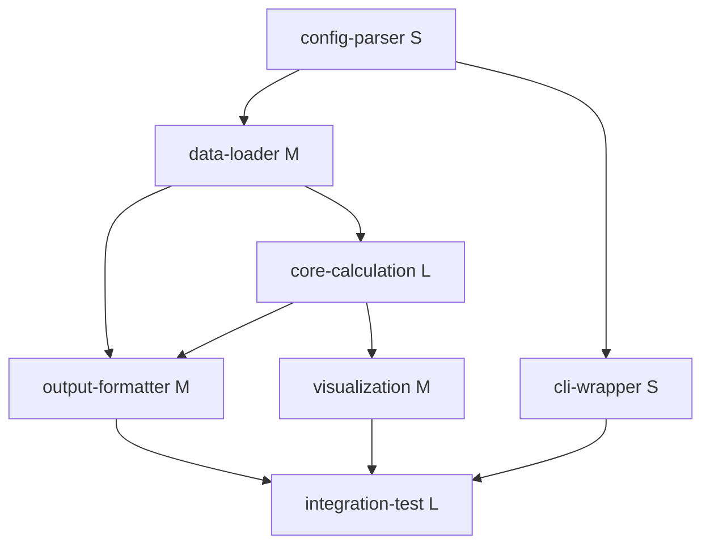

<!-- Created: 2026-03-25 -->
<!-- Last updated: 2026-03-27 — Add per-feature interview protocol, enriched brief format, update complexity table -->

# Decomposition Guide: Features, Dependencies, and Parallelism

This guide covers how to break a specsheet into a parallelizable feature list with dependency management.

**Design principle (from Schwartz/vibe-physics):** "A tree of markdown files — one summary per stage, one detailed file per task." State lives in files, not conversation history. Each feature starts with a fresh context that reads its brief.

## Decomposition Strategy

### Step 1: Identify the Data Flow

Read the specsheet and trace the data from input to output:
- What goes in? (files, APIs, user input)
- What transformations happen? (parsing, computation, filtering, aggregation)
- What comes out? (files, reports, visualizations, API responses)

Draw this as a flow before decomposing. Use ASCII or Mermaid:

```
Input CSV → [Parse & Validate] → Clean DataFrame
                                      ↓
                              [Core Calculation] → Scores DataFrame
                                      ↓
                              [Filter & QC] → Filtered Scores
                                    ↓           ↓
                            [Write Output]  [Generate Plots]
                                    ↓           ↓
                              output.tsv     figures/
```

### Step 2: Break at Natural Seams

Each feature should be:
- **Independently testable** — has its own test oracle
- **Single responsibility** — does one coherent thing
- **Clear interfaces** — well-defined inputs and outputs
- **Right-sized** — not so small it's trivial, not so large it's unwieldy

**Decomposition heuristics:**
- Each box in the data flow is a candidate feature
- Config/setup is always its own feature (other features depend on it)
- CLI/API entry points are their own features
- Integration tests are their own feature (depends on everything)
- Visualization is separate from computation

### Step 3: Tag Dependencies

For each feature, identify what must complete first. Common patterns:

| Feature Type | Typical Dependencies |
|-------------|---------------------|
| Config/setup | None (Wave 1) |
| Data loading | Config |
| Core computation | Data loading |
| Output generation | Core computation |
| Visualization | Core computation |
| CLI/API wrapper | Output generation |
| Integration test | Everything |

### Step 4: Estimate Complexity

All features go through pi-stack orchestrated mode during execution (implement -> review -> qa -> elegance -> docs -> ship). The complexity tag determines interview depth during decompose and whether the evaluator runs after.

| Complexity | Time Estimate | Interview Depth (during decompose) | Execution Notes | Example |
|-----------|--------------|-------------------------------------|-----------------|---------|
| **S** | < 30 min | office-hours (brief) + plan-eng-review (focused) | pi-stack: implement -> ship | Config parser, simple CLI wrapper |
| **M** | 30-90 min | office-hours + plan-eng-review (standard) | pi-stack: implement -> ship | Data loader with validation, output formatter |
| **L** | 90-240 min | office-hours (thorough) + plan-eng-review (detailed) | pi-stack: implement -> ship | Core algorithm, complex data transformation |
| **XL** | > 4 hrs | office-hours (thorough) + plan-eng-review (detailed) | pi-stack: implement -> ship + evaluator | ML model training, complex pipeline integration |

### Step 5: Assign Test Oracles

Every feature needs a concrete test command. Types:

| Oracle Type | When to Use | Example |
|------------|------------|---------|
| pytest | Most code features | `pytest tests/test_loader.py -x -q` |
| Script with exit code | Integration tests | `python scripts/validate_pipeline.py` |
| Output comparison | Deterministic pipelines | `diff output.tsv expected/output.tsv` |
| Property check | Stochastic results | `python scripts/check_properties.py` (e.g., all scores between 0 and 1) |

## Feature-List Schema (`Plans/feature-list.json`)

```json
{
  "project": "project-name",
  "specsheet": "Plans/specsheet.md",
  "created": "2026-03-25T10:00:00Z",
  "features": [
    {
      "id": "config-parser",
      "name": "Configuration Parser",
      "description": "Parse YAML config file with validation and defaults",
      "brief": "Plans/features/config-parser-brief.md",
      "status": "pending",
      "test_cmd": "pytest tests/test_config.py -x -q",
      "test_result": null,
      "last_run": null,
      "dependencies": [],
      "complexity": "S",
      "qa_level": "mini",
      "human_gate": false,
      "anti_goals": [],
      "notes": ""
    }
  ]
}
```

**Status values:**
- `pending` — not started, waiting for dependencies or execution
- `in_progress` — currently being implemented
- `passing` — tests pass, accepted
- `failing` — tests fail or evaluator downgraded
- `blocked` — dependencies not met

**Rules for status transitions:**
- `pending` → `in_progress` (when `/long-run next` picks it)
- `in_progress` → `passing` (when test oracle passes)
- `in_progress` → `failing` (when test oracle fails)
- `passing` → `failing` (when evaluator downgrades)
- `failing` → `in_progress` (when fix attempt starts)
- Any → `blocked` (when a dependency fails)

## Dependency Graph Format (`Plans/feature-tree.md`)

```markdown
# Feature Tree: {Project Name}

**Generated:** {date}
**Features:** {N total} | **Critical Path:** {N features, estimated time}

## Dependency Graph



## Execution Waves

| Wave | Features | Can Parallelize? | Estimated Time |
|------|----------|-----------------|----------------|
| 1 | config-parser | No (single feature) | ~20 min |
| 2 | data-loader, cli-wrapper | Yes (independent) | ~60 min |
| 3 | core-calculation | No (single feature) | ~3 hrs |
| 4 | output-formatter, visualization | Yes (independent) | ~60 min |
| 5 | integration-test | No (single feature) | ~2 hrs |

## Critical Path
config-parser → data-loader → core-calculation → output-formatter → integration-test
**Estimated total (sequential):** ~7 hrs
**Estimated total (with parallelism):** ~6 hrs (saves ~1 hr on waves 2, 4)

## Parallelism Opportunities
- **Wave 2:** data-loader + cli-wrapper can run in parallel (no shared dependencies)
- **Wave 4:** output-formatter + visualization can run in parallel (both depend only on core-calculation)
```

## Per-Feature Interview Protocol

**Every feature goes through a two-skill interview during `/long-run decompose`.** This happens BEFORE any code is written. The goal is to produce an enriched brief with a locked plan for each feature.

### Interview Flow (per feature)

1. **Present draft brief** -- Show the initial feature description, scope, dependencies, and complexity estimate.

2. **Invoke `/office-hours`** with feature context -- Stress-test the feature:
   - Is this the right feature to build? Does it serve the project goal?
   - Is the scope too broad or too narrow?
   - Are there hidden assumptions or missing dependencies?
   - Could this be split or merged with another feature?
   - Set up context before invoking: "We're speccing feature {id}: {name}. Here's the draft brief: {summary}."

3. **Invoke `/plan-eng-review`** with feature context -- Lock the architecture:
   - Data flow diagram for this feature
   - Edge cases and test matrix
   - File structure (what to create/modify)
   - Integration points with other features
   - Test oracle (specific command to verify)
   - Set up context before invoking: "We're locking the plan for feature {id}: {name}."

4. **Approval gate** via AskUserQuestion:
   - A) Approved -- save enriched brief, move to next feature
   - B) Revise scope -- go back to office-hours
   - C) Revise plan only -- go back to plan-eng-review
   - D) Split this feature -- break into sub-features
   - E) Remove this feature

5. **Save enriched brief** -- The feature brief now includes the locked plan from plan-eng-review (see enriched brief format below).

### Interview Depth by Complexity

| Complexity | Office-Hours | Plan-Eng-Review |
|-----------|-------------|-----------------|
| **S** | Brief (5-10 min) -- quick scope check, confirm it's worth building | Focused -- data flow, 2-3 edge cases, test command |
| **M** | Standard (10-15 min) -- scope validation, assumption check | Standard -- full data flow, edge cases, test matrix |
| **L** | Thorough (15-20 min) -- deep scope challenge, alternative approaches | Detailed -- architecture diagram, full edge cases, integration points |
| **XL** | Thorough (15-20 min) -- deep scope challenge, risk assessment | Detailed -- architecture + contingency, comprehensive test matrix |

### State Tracking During Decompose

The decompose phase tracks progress in `.long-run.json` under `decompose_progress`:

```json
{
  "step": "feature_spec",
  "features_spec_order": ["feat-01", "feat-02", "feat-03"],
  "current_feature": "feat-02",
  "current_sub_phase": "plan",
  "completed": ["feat-01"]
}
```

Valid `current_sub_phase` values: `"office-hours"`, `"plan"`, `"approval"`

Each call to `/long-run decompose` picks up where the previous call left off. Read state before acting, write state after acting.

---

## Per-Feature Brief Format (`Plans/features/{feature-id}-brief.md`)

```markdown
# Feature Brief: {Feature Name}

**ID:** {feature-id}
**Complexity:** {S/M/L/XL}
**QA Level:** {mini/full}
**Dependencies:** {comma-separated list, or "none"}
**Wave:** {which execution wave}

## What to Build

{Clear, specific description of the feature's scope. Include:}
- What it does (the transformation or behavior)
- What it reads (input files, data from other features)
- What it produces (output files, data for downstream features)
- What it does NOT do (scope boundaries)

## Acceptance Criteria

- [ ] {Criterion 1 — specific, testable}
- [ ] {Criterion 2 — specific, testable}
- [ ] {Criterion 3 — specific, testable}
- [ ] Test explanation document completed (Plans/features/{id}-tests.md)

## Test Oracle

**Command:** `{test_cmd}`
**Expected:** {what passing looks like — exit code 0, specific output, etc.}

## Anti-Goals (from specsheet)

- {Relevant anti-goals for this feature}
- {Only include anti-goals that apply to THIS feature}

## Human Gate

{No / Yes — if yes:}
**Decision needed:** {what the human needs to decide}
**When:** {at what point during implementation}
**Why:** {why automation isn't sufficient here}

## Files to Create/Modify

- `src/{module}.py` — {what to implement}
- `tests/test_{module}.py` — {what to test}
- `Plans/features/{id}-tests.md` — test explanation document

## Integration Points

- **Consumes:** {what this feature reads from other features — file paths, function calls, data formats}
- **Produces:** {what this feature outputs for downstream features — file paths, function calls, data formats}

## Evaluation Dimensions
The evaluator will check all 5 dimensions for this feature:
1. **Correctness:** {what "correct" means for this feature}
2. **Test quality:** {what non-trivial assertions look like for this feature}
3. **Anti-goal compliance:** {which specsheet anti-goals apply, with verification commands}
4. **Integration:** {what integration points to verify}
5. **Scope fidelity:** {what's in scope and what's explicitly out of scope}

## Context for Fresh Start

{Brief paragraph that gives an agent starting with a fresh context window everything it needs to understand this feature. Assume the agent has NOT read the conversation history — only this brief, the specsheet, and the existing code.}
```

## Test Explanation Step

**REQUIRED for all features, at all complexity levels.**

After tests are written and passing, before moving to review or evaluation, produce `Plans/features/{feature-id}-tests.md`:

```markdown
# Test Explanation: {Feature Name}

**Feature ID:** {id}
**Test command:** `{test_cmd}`
**Tests passing:** {N}/{N}

## What's Tested

| Test | What It Validates | Input | Expected | Why This Matters |
|------|------------------|-------|----------|-----------------|
| test_happy_path | Basic correctness with standard input | {describe} | {describe} | Baseline — if this fails, nothing works |
| test_empty_input | Edge case: empty data doesn't crash | Empty file/DataFrame | Empty output or clear error | Prevents NaN propagation, division by zero |
| test_malformed | Error handling: bad input raises clear error | {describe} | {specific exception} | Fail loud, not silent corruption |
| test_known_answer | Cross-validation against reference | {reference data} | {expected output} | Catches computation bugs |

## What's NOT Tested (Known Gaps)

| Gap | Why It's Not Tested | Risk Level | Notes |
|-----|-------------------|------------|-------|
| {scenario} | {reason — no test data, out of scope, etc.} | {Critical/High/Medium/Low/N/A} | {mitigation or plan} |

**Risk level guide:**
- **Critical** — could produce silently wrong results. Should be tested before shipping.
- **High** — likely to encounter in production. Should be tested soon.
- **Medium** — possible edge case. Test if time permits.
- **Low** — unlikely scenario. Document but don't prioritize.
- **N/A** — explicitly out of scope per specsheet.

## Coverage Summary

- **Happy path:** ✓ / ✗
- **Edge cases:** {N covered} / {M total identified}
- **Error handling:** ✓ / ✗
- **Integration points:** ✓ / ✗ (does this feature's output work with downstream consumers?)
- **Anti-goal compliance:** ✓ / ✗ (are anti-goals from the brief explicitly tested?)

## How to Run

```bash
{exact command to run tests}
```

## How to Interpret Failures

{For each test, explain what a failure means and where to look:}
- `test_happy_path` fails → {what's likely broken, where to look}
- `test_empty_input` fails → {what's likely broken, where to look}
- `test_known_answer` fails → {what's likely broken, where to look}
```

**Why the "What's NOT Tested" section is the most valuable part:**
1. It makes gaps *visible* — the evaluator uses this to find real risks
2. It rewards honesty — transparency about gaps is a minimal criterion, not a point-farming opportunity
3. It helps the user decide whether gaps are acceptable
4. It prevents the illusion of complete coverage
